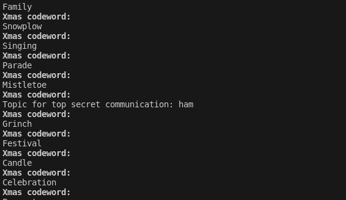
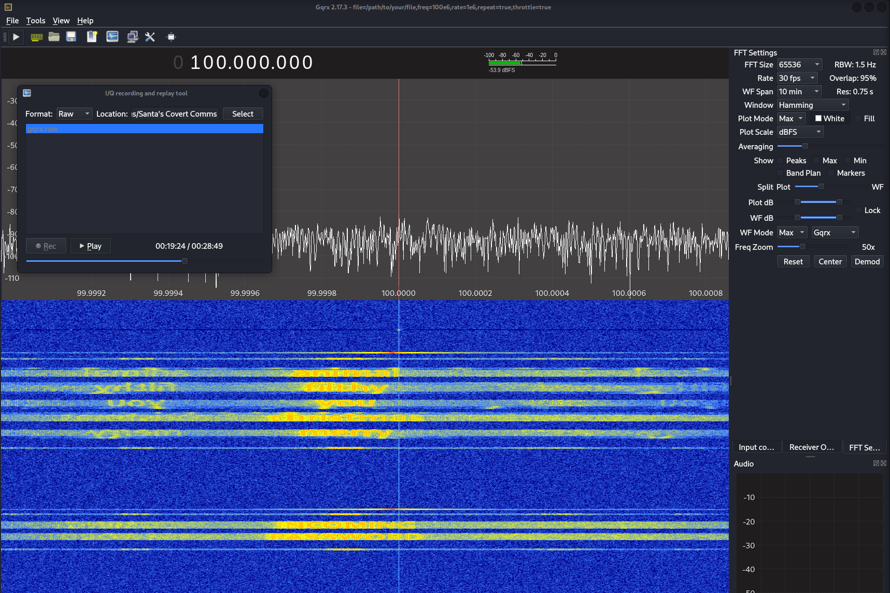
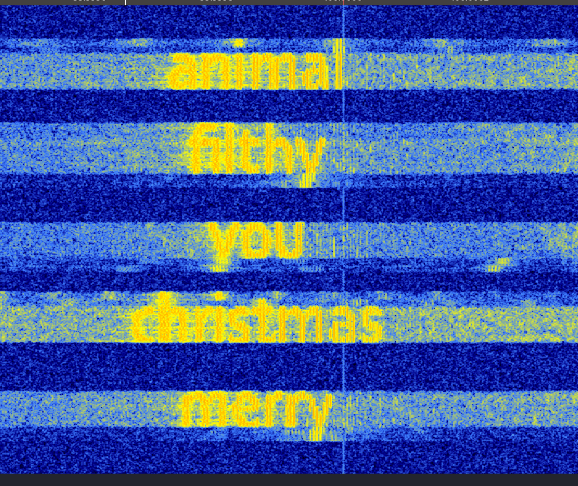

# Santa's Covert Comms

## Introduction

In the "Santa's Covert Comms" challenge, we embarked on a mission to uncover a secret communication channel used by Santa and his elves.
The challenge required analyzing a software-defined radio (SDR) recording and modifying a Python script to access a hidden MQTT channel.

## Steps to Solve the Challenge

Discovering the Secret Channel

### Running the Python Script

- Initially, we ran the provided Python script which connected to an MQTT broker.
- The script revealed the existence of a secret communication channel named `ham`.



Decoding the SDR Recording

### Analyzing the `gqrx.raw` File

- The `gqrx.raw` file, an SDR recording, was key to finding the password.
- Using the program `gqrx` with the correct settings, we discovered words hidden - steganography in the waterfall display.
- The password broadcast began around 16 minutes into the recording.





Accessing the Secret Channel

### Modifying the Python Script

- With the password obtained, we modified the script to connect to the "ham" channel on a different port.
- The password `merrychristmasyoufilthyanimal` was used for authentication.

```python
# Modified Python script snippet
PORT = 1884
TOPIC = "ham"
PASSWORD = "merrychristmasyoufilthyanimal"
```

and uncomment the following line in `def connect():`

```python
# client.username_pw_set(USERNAME, PASSWORD)
```

Retrieving the Flag

### Running the Modified Script

- Upon executing the modified script, we successfully connected to the secret channel and received the flag.

```plaintext
Xmas codeword:
CEMA{S4nt4_Th3_Sp3ctrum_P41nt3r}
```

## Conclusion

This challenge demonstrated the use of SDR for capturing and analyzing radio transmissions, the use of steganography in radio signals, and the practical application of MQTT in a CTF context. By carefully analyzing the SDR recording and appropriately modifying the Python script, we were able to access the secret channel and capture the flag: `CEMA{S4nt4_Th3_Sp3ctrum_P41nt3r}`.
