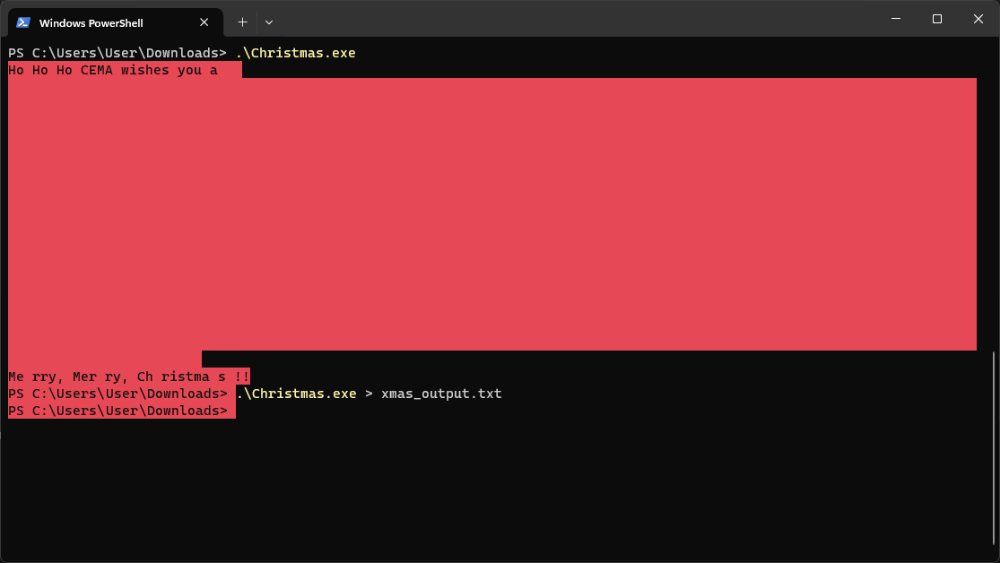
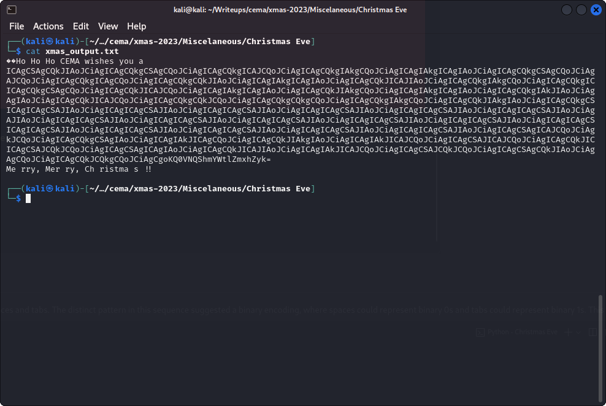
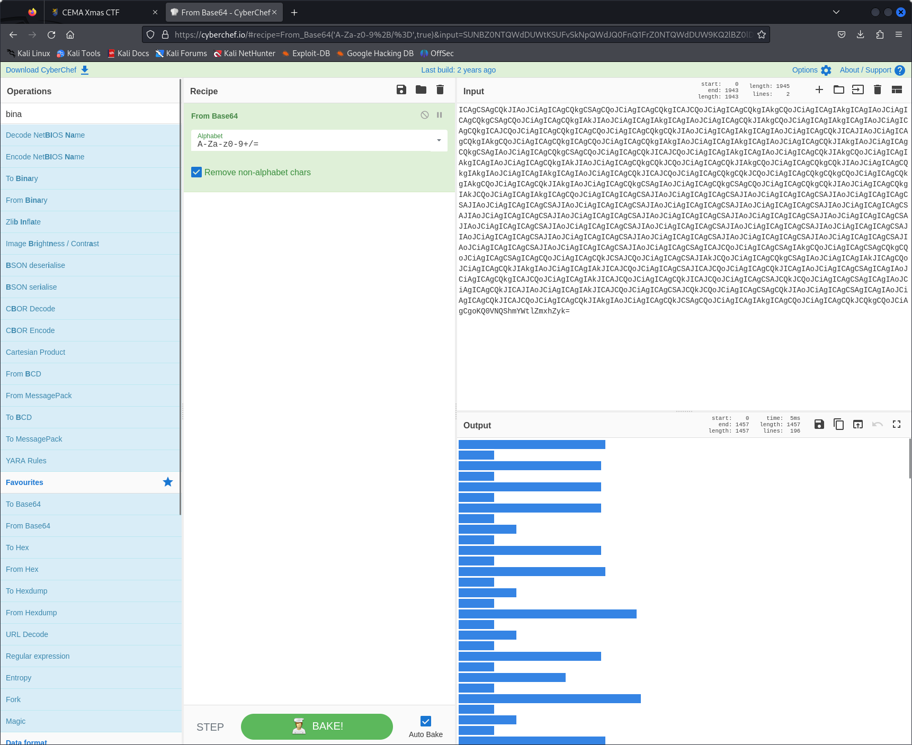
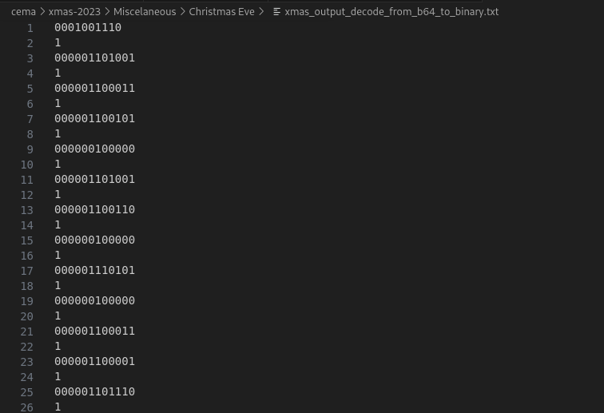
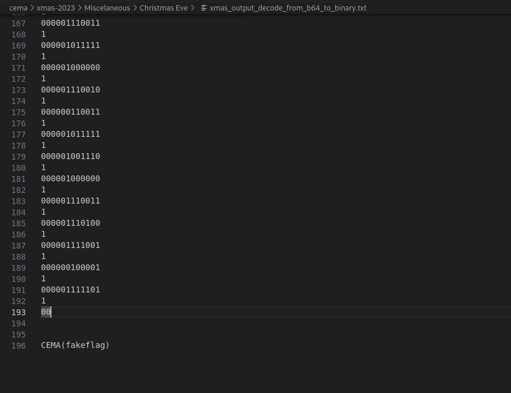

# CTF Challenge Write-up: Decoding `Christmas.exe`

<https://xmas.cema.company/challenges?category=miscellaneous>

## Introduction

During a Christmas-themed Capture The Flag (CTF) challenge, I encountered a binary named `Christmas.exe`. This binary, when executed, produced an output that I redirected to a file named `xmas_output.txt` using the command `Christmas.exe > xmas_output.txt`. Upon analyzing this output, I noticed an intriguing pattern of spaces and tabs, which hinted at the possibility of them representing binary code.







## Analysis of the Output

The output file `xmas_output.txt` contained a sequence of spaces and tabs. The distinct pattern in this sequence suggested a binary encoding, where spaces could represent binary 0s and tabs could represent binary 1s. This observation was crucial in formulating a strategy to decode the message.




## Decoding Strategy

To decode this binary representation, I developed a Python script that would:

- Read and Decode the Base64 String: The output was base64 encoded, which needed to be decoded first to obtain the raw sequence of spaces and tabs.
- Convert Spaces and Tabs into Binary: In this binary sequence, spaces were treated as 0 and tabs as 1.
- Adjustment and Binary to ASCII Conversion: The binary data required some adjustments. Specifically, the last two 0s were moved to the beginning of the string, and an extra 1 that appeared after every 12 characters was ignored. The adjusted binary string was then grouped into 12-bit chunks, each converted into an ASCII character.
- Output the Decoded Message: The script finally pieced together the ASCII characters to reveal the decoded message.

## The Python Script

The Python script used for this challenge is as follows:

```python
import base64

def base64_to_binary(encoded_str):
    decoded_bytes = base64.b64decode(encoded_str)
    decoded_str = decoded_bytes.decode('utf-8')
    binary_str = ""
    for char in decoded_str:
        if char == '\t':
            binary_str += '1'
        elif char == ' ':
            binary_str += '0'
        elif char == '\n':
            continue
    return binary_str

def adjust_and_convert(binary_str):
    adjusted_binary = '00' + binary_str[:-2]
    filtered_binary = ''.join(adjusted_binary[i:i+12] for i in range(0, len(adjusted_binary), 13))
    ascii_result = ''
    for i in range(0, len(filtered_binary), 12):
        chunk = filtered_binary[i:i+12]
        if len(chunk) == 12:
            ascii_result += chr(int(chunk, 2))
    return ascii_result

# Replace this with the actual base64 string from `xmas_output.txt`
encoded_str = "your_base64_encoded_string_here"
binary_str = base64_to_binary(encoded_str)
ascii_result = adjust_and_convert(binary_str)
print("ASCII Result:")
print(ascii_result)
```

## Result

After running the script, the decoded message was successfully revealed:

```kotlin
Nice if u can read this u found something!
CEMA{Wh1t3Sp@c3s_@r3_N@sty!}
```

## Conclusion

The challenge presented by `Christmas.exe` was a fascinating exercise in binary encoding and decoding. The process of analyzing the output, formulating a decoding strategy, and implementing it through a Python script underscored the importance of critical thinking and problem-solving skills in CTF challenges