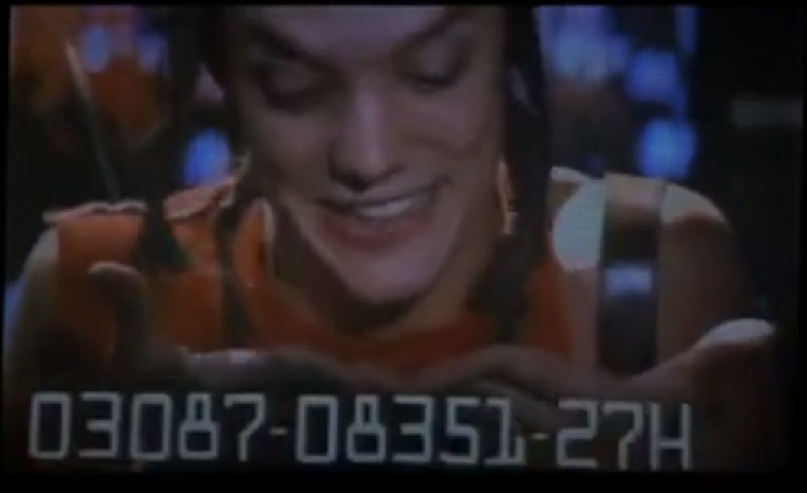
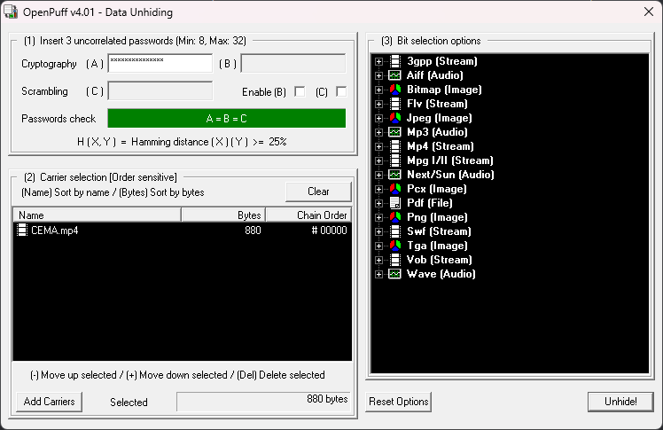
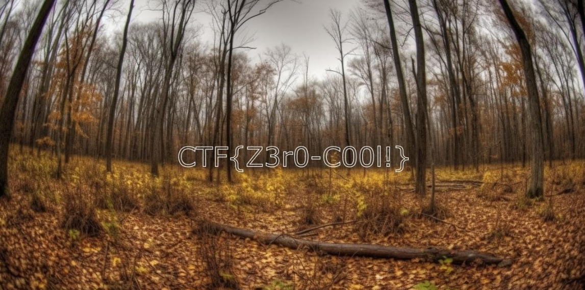

# Santa's Lost Video Challenge Write-up

## Challenge Overview

The challenge involved recovering a crucial video file, `CEMA.mp4`, which contained critical information for the North Pole's festive location. The task required skills in steganography, tooling, and OSINT (Open Source Intelligence).
Steps Taken

1. Analysis of the Video File: Initial examination of the `CEMA.mp4` file using tools like ffmpeg, exiftool, and binwalk to identify any embedded data or unusual characteristics.

2. Extracting Hidden Data: Utilized `OpenPuff`, a steganography tool, to extract hidden data from the `CEMA.mp4` file.

3. Password Discovery: The password for `OpenPuff` was determined to be `03087-08351-27H`. This was identified as the unnamed account in the Bahamas from the 1995 movie "Hackers."

    

    

4. Revealing the Hidden File: The extracted data revealed a file named `itsaprivilegenotaright`.

5. Deciphering the MGRS Coordinates: Inside the extracted file was a partial MGRS (Military Grid Reference System) coordinate `32U LE`. Appending the decoded morse code from the video, `1738621974`, formed the complete MGRS coordinate `32U LE 1738621974`, pointing to a location in Lauwersoog, Groningen.

6. OSINT via Google Maps: Visiting the specified location on Google Maps and examining uploaded images revealed an image containing the flag.

## Conclusion

The flag for the challenge was successfully found to be `CTF{Z3r0-C00l!}`. This challenge showcased the importance of combining various cybersecurity skills and tools, including steganography, OSINT, and the ability to connect clues from different sources.
